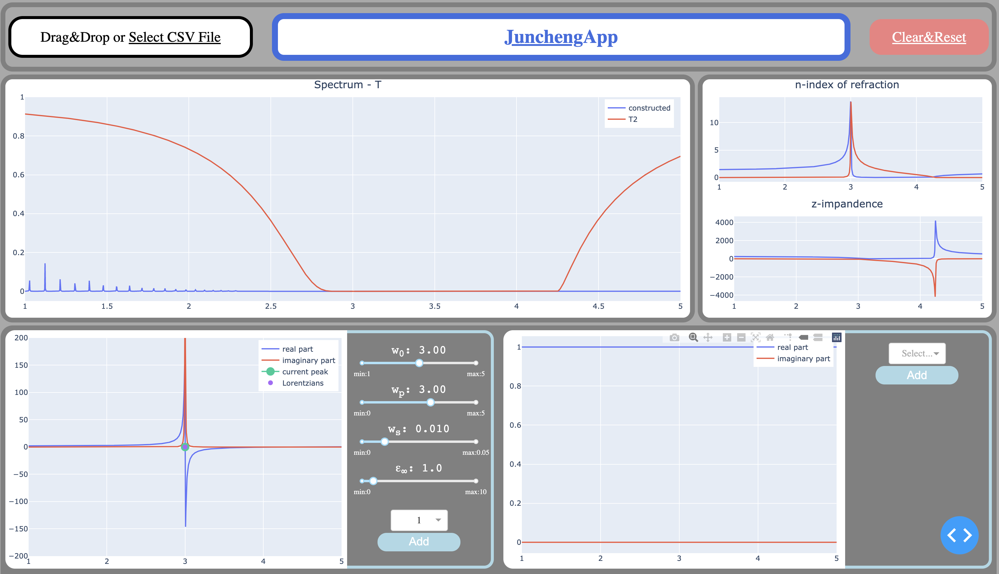

# Spectroscopy-GUI
GUI software for hand-fitting spectrum of meta-materials

## One Problem of Spectroscopy
For a meta-material, we can measure its spectrum T. But what we are really interested, given T, is its permittivity EPSILON and its permeability MU. 
EPSILON and MU are both complex numbers modeled by Lorentzian functions. **So, in essense, if we pick the correct Lorentzian parameters for EPSILON and MU, 
we can have the correct EPSILON and MU that give us the observed T.**

There is an analytical way to go from EPSILON/MU to T. But the process includes an optimization problem that is very sensitive on the initialization
of the Lorentzian parameters. It would be very nice if we can actually **see how the current guess of Lorentzian parameters fit** and **interact with the parameters**
to manually pick a good initialization

## A GUI that Interacts
This repository consists of a browser-based GUI that enables you to (features already implemented)
1. Import file of target spectrum T
2. Add arbitary number of Lorentizans for EPSILON and MU
3. Interact with Lorentzian parameters by sliders 
4. Rerender the fitting result when you are interacting with the parameters
5. Reset/Restart

## Quick Look of the GUI 

## How-To-Use
Usage is very simple. Download the repository. Run the GUI2.py file. Go to localhost:8050 on your brower.
[TO DO: add in dependency]

## Disclaimer
This project is part of my master thesis about Physics Inspired Phase Retrival for Meta-Material.
New features are added in gradually.
